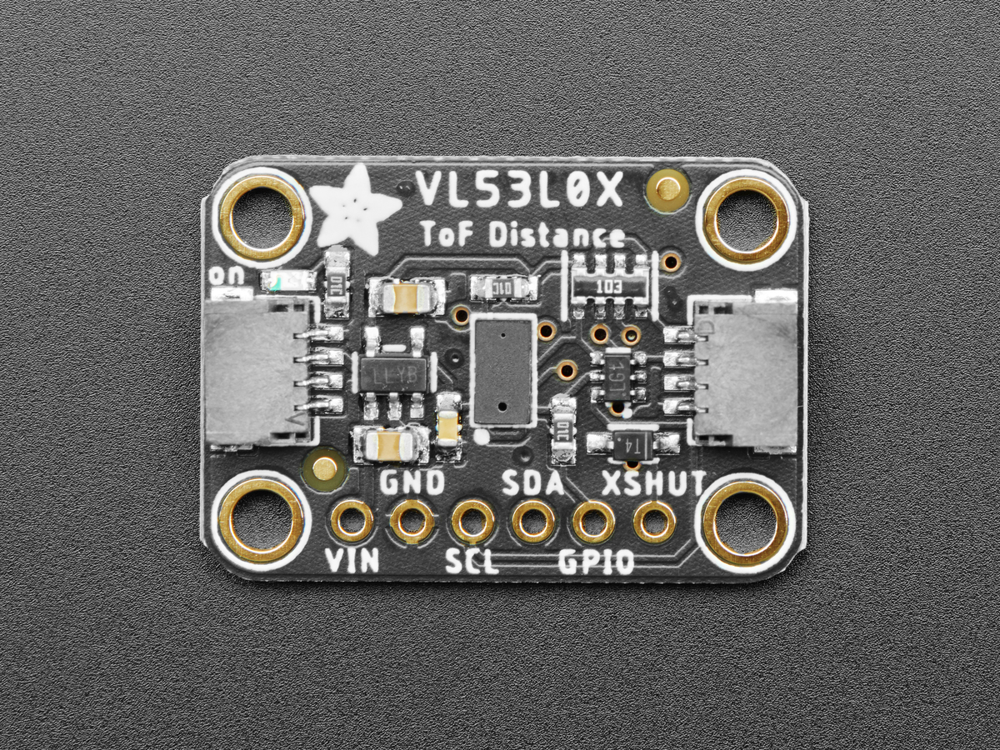
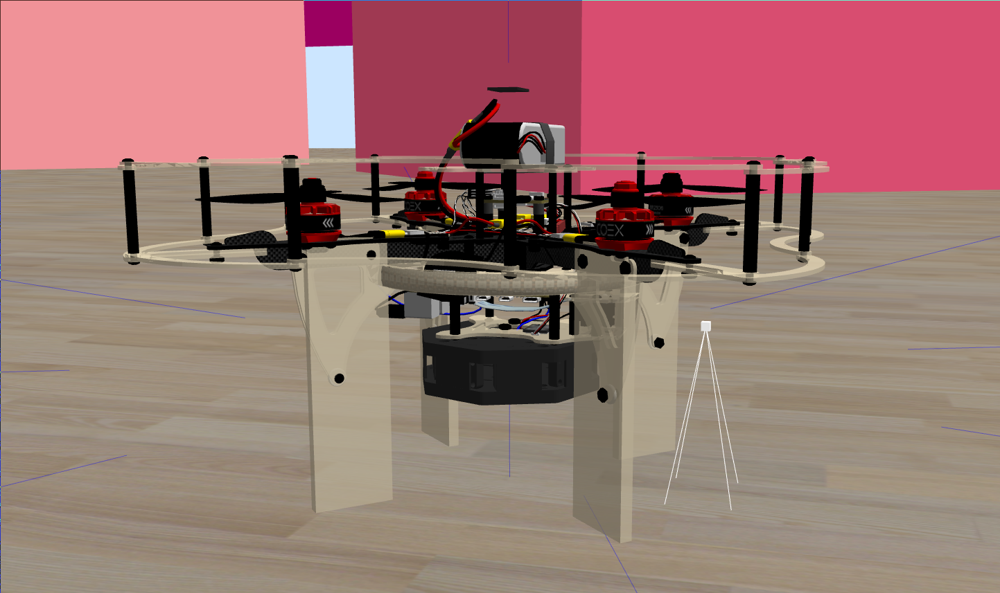
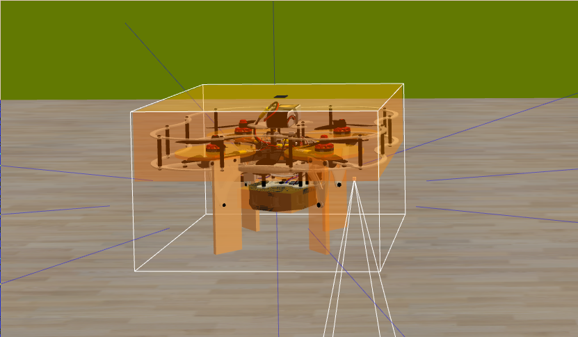
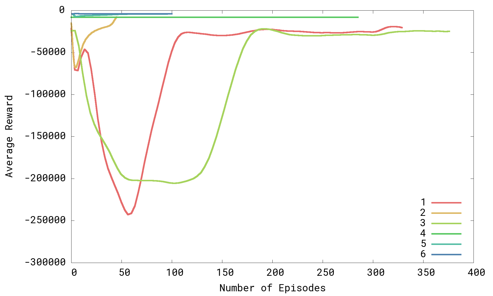
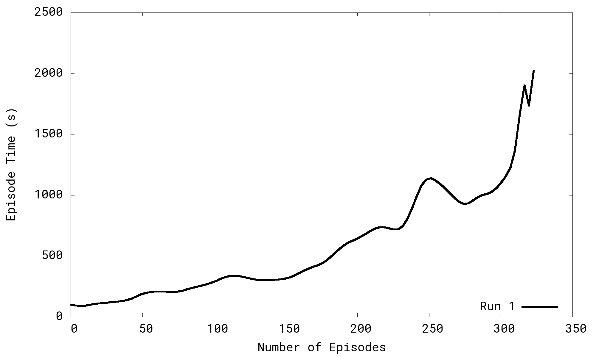
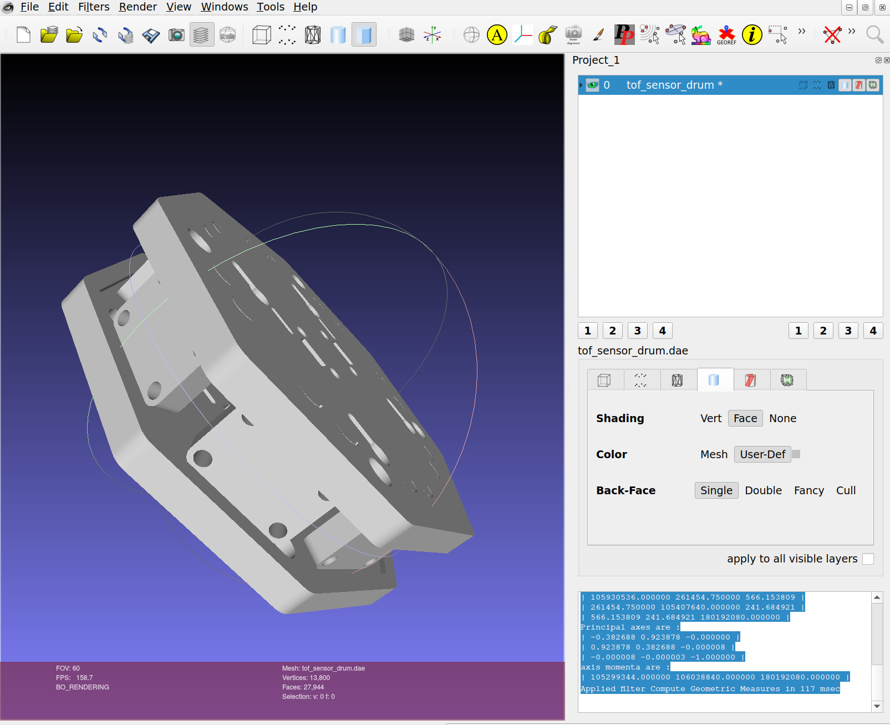

# Introduction

## Motivation

### The Need for Generalized Autonomous Navigation

Autonomous navigation is necessary for a robotic system to interact with its
surroundings in a real world environment, and it is necessary to realize
technologies such as fully autonomous unmanned aerial vehicles (UAVs) and land
vehicles. Modern robotic systems employ a variety of techniques to achieve
spatial awareness. These systems take the form of ranging sensors (acoustic or
optical) or optical flow, which is a steady stream of camera information that is
used to make assertions about the relative positions of objects. Interpreting
reliable and fast 3D spatial data via optical flow requires extensive training
of a convolutional neural network and large amounts of data. Although recent
work has enabled a racing quadcopter to outperform professional pilots using
optical flow, boasting a speed of $22 \frac{\text{m}}{\text{s}}$, this
approach's success was largely specific to its experimental setup and makes a
weak argument for generalized autonomous navigation [@song2023].

Reinforcement Learning (RL) has proven to be a novel and effective method for
autonomous navigation and control [@gugan2023; @song2023; @doukhi2022]. By
defining a set of desired qualities of a system, the system will learn to
develop its own policy, which is responsible for mapping its instantaneous of
its environment to its action at a given point in time.

### Reinforcement Learning

RL has long been considered to be more adaptive than the industry standard
method of control, PID control, which requires extensive tuning. RL tries to
find the optimal way to map a perceived state to an action by finding what is
called a control policy. The decision making is influenced by a reward factor,
which quantifies the success of the system's actions. A control policy is a set
of rules that define the way in which a system's state is mapped to its next
action. This is similar to the Markov decision process, in which an agent's
action at time $\tau_k+1$ is derived from its state at $\tau_k$. Although a
control policy can be defined qualitatively, it is rather a mapping of a state
tensor to an action tensor, both almost always being multidimensional.

Recent investigations into methods of control for quadcopter systems involve
controlling the quadcopter's *attitude*, or the desired state of its position.
As opposed to PID control, which requires tuning between the feedback loop and
action of the controller, RL autonomously solves control problems by optimizing
its actions with respect to a reward metric. This results in an enhanced ability
to react to diverse situations, which would be considered generalized
intelligence [@bernini2021].

### The Growing UAV Industry

The use of unmanned aerial vehicles (UAVs) or drones is becoming increasingly
ubiquitous across various application domains, including real-time monitoring,
wireless coverage, remote sensing, search and rescue, and delivery of goods.
UAVs are thought of to be especially fit for search and rescue applications,
given the dangerous conditions associated with these operations
[@shakhatreh2019].

Although the FAA states that the rate of increase of recreational UAV owners in
the United States has been reported to be slowing in recent years, the UAV
industry is projected to be worth USD 1.5 trillion by 2040 [@faaForecast, p. 46;
@gugan2023, p. 1].

### The Promise of Ranging Sensors

There are numerous hindrances that pose a barrier to ready, widespread adoption
of UAVs in the industry. UAV cameras are still very prone to over and under
exposure when navigating outdoors. This can interfere with the photogrammetric
processes used by many implementations. *Photogrammetry* refers to the
conversion of a set of 2D images to a 3D model. It can be used in place of
LiDAR or in conjunction with LiDAR. UAV camera systems can be delayed in their
response to higher and lower exposure of the course of a flight because of the
presence of sunlight and shaded areas found outdoors. Further, UAV camera
systems struggle in the presence of precipitation and fog [@gugan2023].

Using ranging sensors can mitigate many of the problems associated with UAVs
that rely on optical flow. Although ranging sensors come in varying forms, they
all rely on measuring the Time of Flight (ToF) of an emitted beam of light, that
is, the difference in time $\Delta t$ between $t_{\text{emitted}}$ and
$t_{\text{received}}$. In robotic applications, manufacturers have opted to use
laser diodes in the near infrared (NIR) band because of their inexpensiveness,
which is a result of the exploding fiber optics industry. Additionally, NIR
light is invisible and less harmful the human eye, giving it credibility in
terms of safety [@raj2020, p. 16].

## Goals of the Project

This project aims to train the COEX Clover quadcopter equipped with an array of
Time of Flight (ToF) sensors to perform basic navigation and obstacle avoidance
in randomized scenarios using a Deep Deterministic Policy Gradient (DDPG)
reinforcement learning algorithm. Using randomized environments will test the
effectiveness of curriculum learning for reinforcement learning and the overall
strengths and weaknesses of DDPG for quadcopter control.  By training the
quadcopter to explore randomized environments, this can also demonstrate how
using simpler, more economically affordable sensors can enable a quadcopter to
fly in a GPS-denied environment without the use of LiDAR, which is typically an
order of magnitude more expensive.

<!-- FIXME: rewrite in past tense -->

## Ethical Implications

### Civilian Use

UAV quadcopters have only recently started being mass produced [@chavez2023]. We
can look at numerous cases over the last decade that signal the importance of
regulating and vetting their use. The implications of autonomous UAVs only
exacerbates this.

The FAA reported that over 1.47 million new recreational drone owners registered
in the United States between December 21, 2015 and the end of December 2022. In
2022, the FAA saw an average of 7,866 newly registered recreational UAV owners
per month [@faaForecast, p. 45]. A higher volume of recreational users implies
the increased risk of misuse across various domains.

Any quadcopter equipped with one or more cameras can be considered a risk to
privacy. A flying system that can be remotely operated has the potential to be
exploited to infringe on privacy. Further, an *autonomous* system could add a
layer of anonymity to enable a malicious party to perform simultaneous
operations for the purpose of infringing on privacy [@cummings2017].

In @cummings2017, the authors gathered five incidents in the past decade that
have marked ethical concerns related to UAV operation, which are listed in
{+@tbl:uavincidents}. These cases provide a mere glimpse of the potential misuse
for UAV technology.

Table: Examples of Incidents that Highlight the Safety, Ethical, and Privacy
Concerns Related to UAV Operation (Source: @cummings2017). {#tbl:uavincidents}

+--------------------------+-------------------------+-------------------------+
| Incident(s)              | Significance            | Source                  |
+==========================+=========================+=========================+
| UAV crashes in           | UAV operator claimed    | [@martin2014]           |
| an Australian triathlon  | someone hacked the      |                         |
| injuring an athlete.     | device resulting in the |                         |
|                          | crash.                  |                         |
+--------------------------+-------------------------+-------------------------+
| Drone carrying Albanian  | Incident viewed as      | [@thetelegraph2014]     |
| flag sparked brawl       | “political provocation” |                         |
| between Serbian and      | by Serbian Foreign      |                         |
| Albanian players.        | Minister, reopening old |                         |
|                          | tensions.               |                         |
+--------------------------+-------------------------+-------------------------+
| FAA reports an           | UAVs encroaching on     | [@jansen2015]           |
| increasing number of     | commercial airspace,    |                         |
| UAVs being sighted by    | increasing safety       |                         |
| commercial airlines      | concerns for commercial |                         |
|                          | airlines and passengers.|                         |
+--------------------------+-------------------------+-------------------------+
| UAV on the White House   | Breach of national      | [@berman2015]           |
| Lawn                     | security                |                         | 
|                          |                         |                         |
+--------------------------+-------------------------+-------------------------+
| UAV carrying radioactive | UAVs used to make a     | [@anderson2015]         |
| materials lands on       | political point in      |                         |
| Japanese Prime           | response to Japan’s     |                         |
| Minister’s Office        | damaged nuclear         |                         |
|                          | reactor                 |                         |
|                          |                         |                         |
+--------------------------+-------------------------+-------------------------+

### Military Use

#### Recreational UAVs in The Russian War on Ukraine

Within the first day of the Russian war on Ukraine, the Ukrainian government
urged Ukrainian citizens on social media to donate their recreational drones to
aid in the effort of defense. Ukraine's tactical use of commercial drones caught
Russia off guard and successfully interfered with and surveilled Russian
soldiers through strikes and reconnaissance missions. Interviews with Russian
soldiers have confirmed the psychological exhaustion they experienced from the
fleets of commercial drones, and Russia later took action to reinforce their own
approach by incorporating quadcopters into their tactics, emulating their
opponent [@chavez2023]. This alarmingly rapid adoption of UAVs for use in
warfare could amplify the aim of other terroristic or violent organizations to
do the same, given the accessibility of this kind of UAV technology.

#### Autonomous UAVs for War

Although using commercial UAVs for military purposes may be novel, the use of
UAVs in armed forces is commonplace today. Military grade UAVs are capable of
long-ranged remote reconnaissance and are often weaponized, which minimizes risk
to the party that uses it.

One may think that this undoubtedly removes a drone operator from the
psychological harm that comes with remorse; however, in a comparison of PTSD
experienced between pilots of manned aircraft and UAV pilots, Johnston presses
evidence that ``physical safety does not translate neatly to psychological
safety" [@johnston2022]. UAV pilots are tasked with hundreds of hours of screen
time, learning how their target behaves through painstaking surveillance. As
opposed to the pilot of a manned aircraft, a UAV pilot may not leave the scene
of an operation in a physical sense. Rather than pinning the emotions and
remorse in a physical location and abandoning it, a UAV pilot is often left with
a psychological landscape from which they are never freed. Studies show that
this effect can lead to PTSD comparable to that of a manned aircraft pilot
[@johnston2022].

The downsides to piloted aerial offense form a powerful argument for investing
in the autonomous equivalent. With the advent of autonomous UAVs, many
governments have invested in the promise that autonomy adds to UAV applications.
Autonomous UAV systems need not maintain a wireless connection between their
on-board control system and a ground control station, which is favorable for
military use because of its resilience to jamming [@khalil2022].

The ethical question formed by the notion of autonomous UAVs for military use is
one that seeks the role of a human in warfare. The prospect of applying
autonomous UAVs for tactical purposes separates military powers from the
emotional and psychological consequences of warfare. If, by removing the
inhibitions that are invoked by considering the humanity of the opponent, the
consequences of tactical strikes and surveillance are completely mitigated. This
could change the paradigm of war and perhaps lead to military powers behaving in
a manner of detachment.

### The Ethics of This Project

The training done in this project does not involve interaction with human
beings, and the reward metric is intended to promote the stochastic (or
naturally random) navigation of an environment. Moreover, there is no camera
used in this project, which reduces the ability of the quadcopter to detect a
human being.

While the narrow scope of this project excludes many ethical conversations that
apply to other UAV systems, it does not completely exempt it from potential
misuse. Any malicious entity could integrate the work done here into an effort
intended to cause harm, which is a side effect of creating a generalizable
system such as the one described in this project.

This project has endless implications in search and rescue, where a quadcopter
could explore an area too dangerous for humans. A quadcopter capable of
navigating any kind of environment could automate many tedious tasks such as
cave surveys, agricultural or residential land surveys, and delivery services.
Generalized navigation is a key component to granting this ability. The
realization of this technology would promote the well-being of a society,
regardless of socioeconomic or cultural factors.

# Related work

## GPS-Denied Positioning

This project relies on GPS-denied positioning to estimate the pose of the
quadcopter. GPS-denied positioning is the control of a robotic system using
local measurements to estimate its position rather than coordinates from a GPS
system. Typical implementations of GPS-denied positioning use some form of
computer vision, whether for measuring relative velocity or measuring relative
orientation from markers such as QR codes or ArUco Markers.

### Using ArUco Markers for Position Estimation

<!-- related-work -->
In an effort to demonstrate the ability of a quadcopter to perform basic
navigation, the authors in @bogatov2021 used a grid of ArUco markers to provide
the COEX CLover 4 quadcopter with an optical point of reference. They state: "An
ArUco marker is a synthetic square marker composed by a wide black border and
[an] inner binary matrix which determines its identifier (id)." Using its
on-board camera, the drone resolved its own position by comparing it relative to
each ArUco marker.

By default, the ROS module `aruco_detect` for the Clover 4 is capable of
publishing the positions of ArUco markers as *TF frames*, which is a data type
ROS uses to standardize multiple frames of reference in the context of a global
frame of reference [@clover]. With the goal of tracing out four characters along
an invisible plane using the drone's motion, the group demonstrated that their
method of using ArUco markers kept the quadcopter's position within 0.1 to 0.2m
of the desired waypoints, on average. They attribute the cause of the error to
their haphazard positioning of the ArUco markers and improperly defined PID
controller values [@bogatov2021].

While our project may not use ArUco markers, a comparison can be made
between the effectiveness of ArUco markers and an array of ToF sensors for
determining the local position of the quadcopter.

### Using Monocular SLAM for Position Estimation

<!-- related-work -->

Similarly to how the PX4's position estimation functions, the authors of
[@engel2012] use a downward-facing camera for measuring the velocity of the
quadcopter relative to the ground. However, in addition, they add a
forward-facing camera that is used for monocular Simultaneous Localization And
Mapping (SLAM). Because of the large gaps in time between sensor readouts, they
employ an Extended Kalman Filter (EKF), which is capable of smoothing out
state predictions between varying time steps.

By using a front-facing camera for monocular SLAM, it was discovered that
monocular SLAM efficiently eliminated the accumulated error that can happen
while maneuvering a quadcopter system [@engel2012]. For a similar reason, our
project uses an array of ToF sensors to keep track of the relative location of
obstacles around the Clover. Although there is no form of SLAM used in our
project, by providing the ranging measurements to the reinforcement learning
algorithm's state, we aim to see some form of localization as an emergent
behavior after training. Lastly, because the PX4 architecture employs an EKF for
its control loop, the control principles found in [@engel2012] can be translated
to this project.

## Simulating Quadcopter Dynamics

In order for the control loop to properly decide a course of action based on its
inertial measurements, the dynamics of the system must be calculated. This can
be accomplished via an external frame of reference or by on-board sensors.

<!-- related-work -->

The authors of [@de2014] present a "black box" approach to estimating the
quadcopter's state. Rather than meticulously modeling every part of the
quadcopter's dynamics, a general structure of its mechanics was developed. By
simulating the known properties of the quadcopter, such as the positioning of
its propellers and overall mass, the authors roughly defined how the inputs
(roll, pitch, yaw, and thrust) would be transformed by the flight controller.
This method was combined with a Gaussian Process model, which needed to first be
trained on the former model of estimation. After being trained to predict the
quadcopter's real-time movements within minimal error, the Gaussian Process
model was added to the simulation environment and used in the quadcopter's
on-board state estimation. Although the authors were limited by the processing
power required by Gaussian Process models, their results demonstrated how one
can tailor a rough model to fit real world results by adding a probabilistic
correction [@de2014].

## Reinforcement Learning for Robotics

### Using Reinforcement Learning for Path Planning

<!-- related-work -->

Algorithms such as the famous $\text{A}^{*}$ algorithm require a robotic system
to have a comprehensive understanding of the environment it is in. The authors
in [@hodge2021] combined uses a Proximal Policy Optimization (PPO) algorithm
combined with RL and long short-term memory neural networks for generalized path
planning based only on a systems knowledge of its local surroundings. PPO is
capable of reducing the chances of falling into *local minima* (a common problem
in machine learning when the learning algorithm settles on a sub-optimal
solution before finding the optimal solution) by ensuring that an update to the
learned policy reduces the cost function and does not deviate severely from the
previous policy. By ignoring the altitude of the quadcopter, the authors of
[@hodge2021] reduce the problem to two dimensions, and they leave all matters of
dynamic control up to the reader. This means that their method provides a way to
recommend which movements to make without actually controlling the system.

Our project follows a very similar path, relying on the onboard flight
controller's control to navigate to setpoints; however, because the policy has
no long-term memory, we rely on the action-value function, which is trained off
of historical training data, to properly weigh the decision-making process to
navigate coherently through an environment.

<!-- related-work -->

The authors in [@doukhi2022] present a hybrid approach of dynamic control and
navigation by allowing the quadcopter to act upon its planned motion via
grid-like movements until it approaches any obstacles. Once an obstacle is
approached, the control is handed over to a policy whose goal is to navigate
around the obstacle while maintaining forward motion. For each instantaneous
reward, if there are no obstacles within 2m of the quadcopter, the quadcopter is
greatly rewarded for forward movement. This incentivizes it to continue
exploration. This effort validates the hybrid use of inertial navigation for the
majority of a quadcopter's movements and a handover of control to a trained obstacle
avoidance model for more precise movements.

The approach found in [@doukhi2022] makes a strong argument for hybrid control
because of its refined scope. This will consequently allow for RL training to
take place for a consistent kind of problem, rather than leaving both 'free'
navigation and obstacle avoidance for the quadcopter to handle.

### Using Reinforcement Learning for Attitude Control

Giving a quadcopter complete control over its attitude requires extensive
training and computational power to train because of how large the action and
state spaces become. Continuous action and state spaces, as opposed to discrete
action and state spaces, require a completely distinct set of algorithms for
training, because of the infinite number of states and actions possible.

<!-- related-work -->

The authors in [@bernini2021] compare different RL algorithms' and control
algorithms' effectiveness in controlling a quadcopter's attitude. They found
that the Deep Deterministic Policy Gradient (DDPG) and Soft Actor-Critic (SAC)
algorithms performed the best and exhibited the most robustness when simulated
with environmental uncertainty such as wind gusts and motor failures
[@bernini2021, p. 9]. To reach convergence, however, they trained their models for a
few million iterations each. By putting multiple instances on a Kubernetes
cluster, they were able to parallelize training runs and reduce the training
time signifianctly [@bernini2021, p. 6].

This article proves that actor-critic models seem to work well for quadcopter
control. Although the DDPG algorithm is deterministic, we would expect it to
perform similarly well for quadcopter control in our project.

That said, the authors noted that some training algorithms exhibited poor
exploration because of the randomized sampled actions being clipped to their
minimum or maximum values. Because our project takes a similar approach to
clipping stochastic actions to fit into a valid range, there is high possibility
that a similar phenomenon will hinder the training process.

### Curriculum Learning for Quadcopter Control

Curriculum learning is when an agent is given tasks in a specific sequence that
accelerate the rate at which learning is achieved. The authors in
[@narvekar2020] define a curriculum to be a way "to sort the experience that an
agent acquires over time, in order to accelerate or improve learning." Our
project seeks to train agent off of a curriculum of ten increasingly difficult
world files in the Gazebo simulation environment.

<!-- related-work -->

The authors of [@park2021] take a similar approach to our project to training a
quadcopter for autonomous navigation, using ROS and Gazebo for reinforcement
learning over a continuous action space. They trained two models, both with
different reward metrics, first in a rectangular room with no obstacles, and
then in the same room with randomly-placed obstacles. After the success rate of
each model would asymptotically approach 100%, they transferred the same agent
to a room with randomly placed obstacles.

Although they used the Proximal Policy Optimization (PPO) reinforcement learning
algorithm, the authors of [@park2021] witnessed convergence at $\approx 200$
episodes, which gives a reasonable benchmark for how many episodes our project
will take to reach convergence.

<!-- related-work -->

The authors of [@deshpande2020] trained a quadcopter capable of thrust vectoring
its rotors employing a reinforcement learning curriculum. By first starting with
a quadcopter system trained via PPO without thrust vectoring, they transferred
the learned policy to a more complex quadcopter system capable of thrust
vectoring. They found that the curriculum learning allowed for the trained
policy to be more robust in the higher dimensional action space from allowing
thrust vectoring than a typical ground-up approach.

The adaptability of a PPO algorithm in the context of curriculum learning makes
a case for the expected adaptability of a DDPG algorithm in curriculum learning.
Because both PPO and DDPG are model-free algorithms with continuous state and
action spaces, we expect similar levels of aptness for curriculum learning.

# Method of Approach

This project uses the Copter Express (COEX) Clover quadcopter platform, equipped
with Time of Flight (ToF) ranging sensors, and applies a Deep Deterministic
Policy Gradient (DDPG) algorithm to train it for autonomous navigation. By
simulating the Clover in the Gazebo simulation environment, hundreds of
iterative attempts can be taken to safely train the quadcopter's navigation
ability [@gazebo].

Rather than developing an algorithm for navigation, we employ a variety of RL
techniques to motivate the quadcopter to autonomously explore its environment.
By adding Ornstein-Uhlenbeck noise to each sampled action, we can ensure the
quadcopter's likeliness of navigating its environment.

The code and documentation for running this project can be found at
\url{https://github.com/ReadyResearchers-2023-24/SimonJonesArtifact}.

## Project Design

### COEX Clover Quadcopter Platform

The COEX Clover quadcopter, depicted in {+@fig:clover}, is a platform for
education and research developed by Copter Express. On board, the Clover has the
Raspberry Pi 4 computer for performing computations and running the Robotic
Operation System (ROS). In this specific project's use case, ROS is responsible
for communicating between the on-board flight controller's measurements, which
defines the state, and mapping the state to govern the next action the flight
controller will take. The on-board flight controller is the COEX Pix, which
operates off of the PX4 flight stack, an open source autopilot software for
various applications. The COEX Pix has two built in sensors listed in
{+@tbl:coexpixsensors} [@clover].

![COEX Clover 4 Quadcopter [@clover].](images/clover.png){#fig:clover width=75%}

Table: Built-in sensors in the COEX Pix platform [@clover].
{#tbl:coexpixsensors}

+--------------+--------------------------------------+
| Sensor Name  | Description                          |
+==============+======================================+
| MPU9250 9DOF | accelerometer/gyroscope/magnetometer |
+--------------+--------------------------------------+
| MS5607       | barometer                            |
+--------------+--------------------------------------+

### Time of Flight (Tof) Ranging Sensors {#method-tof-sensors}

In order for the quadcopter to detect its surroundings, we employ ten Time of
Flight (ToF) ranging sensors, positioned in an arrangement inspired from
[@hodge2021], where the authors propose an octagonal arrangement of of sensors
to measure spatial data laterally along the $x-y$ plane. In this project,
however, we add two more sensors, one facing the $+z$ direction and another
facing the $-z$ direction. By adding these vertical sensors, the quadcopter may
modify its vertical motion to better navigate.

The ToF sensor used in this project is the Adafruit VL53L4CX, depicted in
{@fig:vl53l4cx}, which has a range from 1mm up to 6m. This device has a FOV of
$18^\circ$ and is controllable via the I2C protocol.

{#fig:vl53l4cx
width=75%}

In order to mount the ToF sensors to the Clover, a custom fixture was created to
mount onto the clover. For the eight horizontal ToF sensors, an octagonal
drum-like fixture was developed, which points each ToF sensor at incrementing
angles of $45^\circ$; however, in order for the Clover's legs to not obstruct
the ranging sensors, the ToF sensor drum's yaw is offset by $22.5^\circ$.
{+@fig:tof_sensor_drum} depicts a model of the ToF sensor drum and a top plate
used to mount the sensor in the $+z$ direction. Note that the bottom of the ToF
sensor drum can also mount a ToF sensor. In
{+@fig:tof_sensor_drum_on_clover_in_gazebo} the simulated model is depicted,
attached to the simulated model of the Clover, and in {+@fig:collision-boxes}
the visualization of each link's collision box can be seen.

{#fig:tof_sensor_drum width=75%}

{#fig:tof_sensor_drum_on_clover_in_gazebo width=75%}

{#fig:collision-boxes width=75%}

### Deep Deterministic Policy Gradient (DDPG) Algorithm

#### Gradient Ascent and Descent

The method of learning used in this project is the Deep Deterministic Policy
Gradient algorithm, which maps a continuous state space to a continuous action
space.

In RL algorithms, training is accomplished by giving the system a feedback
mechanism called a reward. The reward may be based off of historical data or on
the most recent state of the system. In DDPG, we train two networks, an
action-value or critic network, and a policy or actor network. The action-value
network has access to historical training data, while the policy network does
not. The two networks inform each other in the training process.

One method of finding an optimal policy for controlling a system is to track the
gradient of the expected reward, which is done by varying the weights of the
policy and measuring the gradient of the reward with respect to the weights. The
training algorithm uses *gradient ascent* in this case, where it tries to
maximize the reward.

In regards to the action-value network, the gradient of the error between the
expected and actual reward with respect to the weights is calculated. The
training algorithm uses *gradient descent* in this latter case, trying to
minimize the error to achieve {+@eq:bellman}

#### State and Action Spaces

We define the state space $S$ of the quadcopter by twenty-five parameters and
their corresponding range of values, detailed in {+@tbl:state}. Additionally, we
define the action space $A$ of the quadcopter by three parameters and their
corresponding range of values and activation functions, detailed in
{+@tbl:action}.

Table: The values that exist in the state space of the quadcopter system.
{#tbl:state}

+----------------------+----------------------+---------------------------+--------------------------+
| Name                 | Domain               | Units                     | Description              |
+======================+======================+===========================+==========================+
| $x_{\text{desired}}$ | $\mathbb{R}$         | $\text{m}$                | Desired position         |
+----------------------+----------------------+---------------------------+                          +
| $y_{\text{desired}}$ | $\mathbb{R}$         | $\text{m}$                |                          |
+======================+======================+===========================+==========================+
| $p_x$                | $\mathbb{R}$         | $\text{m}$                | Current position         |
+----------------------+----------------------+---------------------------+                          +
| $p_y$                | $\mathbb{R}$         | $\text{m}$                |                          |
+----------------------+----------------------+---------------------------+                          +
| $p_z$                | $\mathbb{R}$         | $\text{m}$                |                          |
+======================+======================+===========================+==========================+
| $q_x$                | $\mathbb{R}$         | dimensionless             | Quaternion orientation   |
+----------------------+----------------------+---------------------------+                          +
| $q_y$                | $\mathbb{R}$         | dimensionless             |                          |
+----------------------+----------------------+---------------------------+                          +
| $q_z$                | $\mathbb{R}$         | dimensionless             |                          |
+----------------------+----------------------+---------------------------+                          +
| $q_{\omega}$         | $\mathbb{R}$         | dimensionless             |                          |
+======================+======================+===========================+==========================+
| $v_x$                | $\mathbb{R}$         | $\text{m}\text{s}^{-1}$   | Current velocity         |
+----------------------+----------------------+---------------------------+                          +
| $v_y$                | $\mathbb{R}$         | $\text{m}\text{s}^{-1}$   |                          |
+----------------------+----------------------+---------------------------+                          +
| $v_z$                | $\mathbb{R}$         | $\text{m}\text{s}^{-1}$   |                          |
+======================+======================+===========================+==========================+
| $\omega_x$           | $\mathbb{R}$         | $\text{rad}\text{s}^{-1}$ | Current angular velocity |
+----------------------+----------------------+---------------------------+                          +
| $\omega_y$           | $\mathbb{R}$         | $\text{rad}\text{s}^{-1}$ |                          |
+----------------------+----------------------+---------------------------+                          +
| $\omega_z$           | $\mathbb{R}$         | $\text{rad}\text{s}^{-1}$ |                          |
+======================+======================+===========================+==========================+
| $\text{range}_0$     | $[0.001, 6]$         | $\text{m}$                | Distance measurements    |
+----------------------+----------------------+---------------------------+ from ToF sensors         +
| $\text{range}_1$     | $[0.001, 6]$         | $\text{m}$                |                          |
+----------------------+----------------------+---------------------------+                          +
| $\text{range}_2$     | $[0.001, 6]$         | $\text{m}$                |                          |
+----------------------+----------------------+---------------------------+                          +
| $\text{range}_3$     | $[0.001, 6]$         | $\text{m}$                |                          |
+----------------------+----------------------+---------------------------+                          +
| $\text{range}_4$     | $[0.001, 6]$         | $\text{m}$                |                          |
+----------------------+----------------------+---------------------------+                          +
| $\text{range}_5$     | $[0.001, 6]$         | $\text{m}$                |                          |
+----------------------+----------------------+---------------------------+                          +
| $\text{range}_6$     | $[0.001, 6]$         | $\text{m}$                |                          |
+----------------------+----------------------+---------------------------+                          +
| $\text{range}_7$     | $[0.001, 6]$         | $\text{m}$                |                          |
+----------------------+----------------------+---------------------------+                          +
| $\text{range}_8$     | $[0.001, 6]$         | $\text{m}$                |                          |
+----------------------+----------------------+---------------------------+                          +
| $\text{range}_9$     | $[0.001, 6]$         | $\text{m}$                |                          |
+======================+======================+===========================+==========================+

Table: The values that exist in the action space of the quadcopter system and
their corresponding activation functions.
{#tbl:action}

+--------+----------------------+---------------+---------------------+
| Name   | Domain               | Units         | Activation Function |
+========+======================+===============+=====================+
| r      | $[0.2, 6]$           | meters        | RelU                |
+--------+----------------------+---------------+---------------------+
| theta  | $[0, \pi]$           | radians       | RelU                |
+--------+----------------------+---------------+---------------------+
| phi    | $[0, 2\pi]$          | radians       | RelU                |
+--------+----------------------+---------------+---------------------+

#### Network Architectures

The architecture for the policy and action-value networks are both adapted from
Keras's documentation on the DDPG algorithm [@keras].

The policy network contains an input layer with the same dimension as $S$, two
dense layers, each with $256$ neurons with a rectified linear unit (ReLU)
activation function, and an output layer with three neurons, each with a ReLU
activation function. When actions are sampled, they are clipped to the range of
the valid action space. Although the authors of [@bernini2021] observed this to
be harmful to encouraging exploration, the initializing functions for the output
layer are created using Tensorflow's `random_uniform_initializer` function,
which is used to initialize the output tensor in the range `[minval, maxval]`.

The action-value network contains two input layers: an input layer with the same
dimension as $S$, and an input layer with the same dimension as $A$. The $S$
input is connected to two dense layers of size $16 \times 32$ with ReLU
activation functions, and the $A$ input is connected to one dense layer of size
$32$ with ReLU activation functions.

The two layers are concatenated to create a layer of size $64$, which is then
connected to two dense layers of size $256 \times 256$. This is then connected
to the output layer.

### Gazebo Simulation Environment

This project uses Gazebo to run a simulated environment of the Clover. Gazebo is
an open source tool for simulating robotics; it simulates the dynamics and
actuation of robotic systems. COEX has developed a simulation environment that
can be used in Gazebo for simulating the Clover [@gazebo].

Gazebo allows for the environment to be defined by physical parameters such as
wind, atmospheric type, and gravity, and it uses the *Open Dynamics Engine* to
resolve physical interactions.

#### `.world`, `.sdf`, `.urdf` Files and Meshes

Gazebo supports the parsing of `.world` files, which is a special kind of `.sdf`
file that describes the environment to Gazebo. `.sdf` stands for Simulation
Description Format, and it defines a specification for describing elements in
simulation environments. The specification (\url{http://sdformat.org/spec})
allows for `<world>`, `<model>`, `<actor>`, and `<light>` root elements.

COEX has supplied their own `.sdf` and `.urdf` (Universal Robotics Description
Format) files that describe the Clover. These files are located within the
`clover_description` package; however, they are written as `.xacro` files, which
is an intermediate format used to construct larger hierarchies of `.sdf` and
`.urdf` files.

#### Links and Joints

Both `.sdf` and `.urdf` allow for the specification of *links*, parts of a
robotic system, and *joints*, hierarchical relative frames of reference between
links. In general, the fundamental link that comprises every robotic system is
named `base_link`.

In the following example, a `.xacro` file is provided, which compiles into a
`.urdf` file. First, the `<robot>` tag is defined, which tells `xacro` that the
macros inside of it are all part of the same robot model. Using `xacro`,
parameters can be supplied to elements, which allows for the reuse of elements.
In this case, `mass`, `body_width`, `body_height`, and `*inertia` are all
parameters to be specified at the parent level.

```xml
<robot xmlns:xacro="http://ros.org/wiki/xacro">
  <!-- macro name to be referenced in other files -->
  <xacro:macro name="clover4_base_macro"
    params="mass body_width body_height *inertia">
```

After defining a `base_link` link, a joint can be created to join elements to
it. In this case, a link named `base_link_inertia`, which is a pseudo-element to
provide inertia to the base link, is positioned at the origin of the
`base_link`.

```xml
    <link name="base_link"></link>
    <!-- join base_link to its inertial properties -->
    <joint name="base_joint" type="fixed">
      <origin xyz="0 0 0" rpy="0 0 0" />
      <parent link="base_link" />
      <child link="base_link_inertia" />
    </joint>
```

While defining the `base_link_inertia` link, inertial, visual, and collision
elements are specified to make it ready for simulation.

```xml
    <link name="base_link_inertia">
      <!--
        define inertial elements for
        calculating dynamics via ode
      -->
      <inertial>
        <mass value="${mass}" />  <!-- [kg] -->
        <origin xyz="0 0 0" />
        <xacro:insert_block name="inertia" />
      </inertial>
      <!--
        define visual element,
        has no effect on physics
      -->
      <visual name="body">
        <origin xyz="0 0 0.025" rpy="0 0 0" />
        <geometry>
          <!--
            Note: Texture files are expected
            to be in the same directory as the model
          -->
          <mesh filename="package://clover_description/meshes/clover4/clover_body_solid.dae"
            scale="1 1 1"/>
        </geometry>
      </visual>
      <!--
        define collision element for
        calculating collisions via ode
      -->
      <collision name="base_link_inertia_collision">
        <origin xyz="0 0 0.05" rpy="0 0 0" />
        <geometry>
          <box size="${body_width} ${body_width} ${body_height}" /> <!-- [m] [m] [m] -->
        </geometry>
      </collision>
    </link>
```

Lastly, if Gazebo is being used, optional parameters can be specified to tell
Gazebo how to resolve relationships between links and joints. Further, plugins,
such as sensors, motors, or other actuators can be defined under the `<gazebo>`
tag.

```xml
    <!-- tell gazebo about this link, specifying custom physics properties -->
    <gazebo reference="base_link">
      <self_collide>0</self_collide>
    </gazebo>
    ...
  </xaro:macro>
</robot>
```

#### Using Custom Meshes in Simulations

The ToF drum created for this project, explained in section
[](#method-tof-sensors), had to go through steps of preparation before importing
it into Gazebo as an `.sdf` file.

In order to use an `.STL` file in a robotics simulation, its inertial and
collision properties must first be calculated. This can be done in a variety of
ways, but, in this project, we use a combination of OnShape, Blender, and
Meshlab to do so [@onshape, @blender, @meshlab]. Section
[](#preparing-stl-files-for-simulation) explains in detail how to prepare
meshes for simulations, but here we will give a concise overview of the process.

After exporting it as an `.STL` file from the CAD software OnShape, the `.STL`
file was imported into Blender in order to convert it to a COLLADA `.dae` file
[@blender, @onshape]. Although plugins like
[`onshape-to-robot`](https://github.com/Rhoban/onshape-to-robot) exist for
converting OnShape projects to `.sdf` formats, this project manually processes
the mesh files to reduce the stack of software relied upon.

Upon being converted into the COLLADA format, the mesh can be processed by
MeshLab, an open source mesh processing tool. MeshLab can calculate the
collision box for a given mesh and calculate the inertia tensor in generalized
units.

Having calculated the physical properties of the mesh, it can be referenced
under the `<visual>` tag of either a `.urdf` or `.sdf` file, and the physical
properties can be put in the `<inertial>` and `<collision>` tags. Using this
combination of software makes integrating custom 3D models accessible and easy
for roboticists.

## Experimental Design

In this project's experiment, we seek to train a simulated quadcopter system to
navigate to a desired position in its environment via the DDPG RL algorithm.

We employ the concept of *curriculum learning*, in which groups of training
episodes get progressively more difficult over time. Curriculum learning aims to
optimize the rate at which skills are learned in an RL algorithm by giving the
actor tasks that are more readily solvable at a given epoch. In our case, the
curriculum consists of ten increasingly difficult environments to navigate in.

With the goal of each episode being to navigate above a point in the $xy$ plane,
the actor is given a reward based on the its proximity to desired location,
number of collisions, distance from the ground, and if it is unable to travel
to a waypoint it set for itself. More information about the reward metric is
explained in section []{#reward-metric}.

Training is governed by a ROS node fittingly named `clover_train`.
`clover_train` stores episodic data and trains the policy and action-value
function while managing subprocesses such as the Gazebo simulation environment
and logging training data.

### World Generation

In order to test the robustness of our training algorithm, we use the package
`pcg_gazebo` by Bosch Research to generate environments to test and train the
Clover in [@manhaes2024]. For the experiment, ten procedurally-generated
`.world` files are created.

Each world is generated by taking the union of the footprints of $n$ number of
rectangles. Each generated world has an increasing number of rectangles used in
order to make the *cirriculum* increasingly difficult. Figure @fig:footprint
depicts an example of a `.world` file generated using `pcg_gazebo`.

Section []{#procedurally-generating-rooms-using-pcg-module-and-pcg_gazebo}
provides a tutorial on how to use `pcg_gazebo` for world generation, through
command-line utility itself and the ROS wrapper created in this project.

{#fig:footprint width=75%}

#### Random Obstacle Generation

Inside of each world, two randomly sized cuboids and two randomly sized
cylinders are placed at random positions. While Bosch Research's algorithm to
keep objects inside of the footprint of the generated room is faulty, i.e.,
there is a chance of an object being placed not inside the room, it places
objects in the room *most* of the time, which is all that is needed for this
project. Upon generation, each model is saved in its own directory, named
relative to the world it corresponds to.

#### Calculating Available Coordinates Inside Room Footprint

To avoid an over-trained policy, each training episode places the quadcopter at
a random position within the footprint of the room's boundary. This is done by
an algorithm that picks random points within the room and writes them to an
`.xml` file for later reading.

<!-- FIXME: now talk about randomly putting objects and finding free spots -->
<!-- FIXME: make sure to reference the appendix for tutorials on how to generate
worlds. -->

### Training Steps

For each *episode*, or iteration, of the training process, a state $s$ is
derived from the quadcopter's telemetry. The state is then provided as an input
to the policy, which samples a reward and applies Ornstein-Uhlenbeck (OU) noise
to encourage exploration without disrupting the continuum of the actions being
taken [@spinningup2018]. After the policy provides an action, the action is
converted from spherical to Cartesian coordinates and given to the PX4 flight
controller as a setpoint.

The `clover` ROS package provides the service `navigate` that uses the PX4's
on-board Visual Position Estimation (VPE) to move to given coordinates. By
connecting a RPi camera and a downward-facing ToF ranging sensor to a Raspberry
Pi running `mavros` connected to the PX4, the PX4 can calculate its local
position [@clover].

Each episode begins by using `navigate` to reach $(0, 0, 0.5)$ in the `map` or
base reference frame. If it takes longer than ten seconds to navigate to this
point, the system continues to attempt to navigate to this point. If it fails a
total of three times, all of running nodes are killed and restarted. This
sequence aims to prevent transient issues (of which there are many) observed
when running the simulated PX4 firmware.

Once the Clover reaches its initial position of $(0, 0, 0.5)$, the first action
$a$ is sampled from the policy $\mu_{\theta}$, and noise is added to it. The
sampled action, i.e., a position relative to the Clover's frame, is then
navigated to using `navigate` once again. If the quadcopter is unable to reach
the position derived from $\mu_{\theta}$ within a certain number of seconds, the
action is aborted, and the timeout is taken into account by the reward metric.

After $a$ is acted upon, $s$ is read once again in order to determine the reward
metric, which takes off points proportional to the distance away the quadcopter
is from its goal or if the quadcopter has crashed or flipped over.

The reward metric is then recorded, and the gradient of the reward metric is
measured with respect to the action and state variables [@spinningup2018]. The
`keras.optimizers.Adam` optimizing function, provided by Keras, is then
used to modify the policy and the action-value function's weights [@keras].
This is when the learning happens.

Each episode restricts the agent to navigate to the desired position in 4 moves.
Because the maximum distance the agent is capable of traveling is 6m, this would
be a trivial task using $\mu^*$ and $Q^*$.

### Reward Metric {#reward-metric}

The reward metric, defined in {+@eq:reward-metric}, outlines how a reward is
granted to the agent for each episode.

$$
\begin{array}{rl}
(1) & r_t = 0 \\[2ex]
(2) & r_t \leftarrow r_t - 1000 \cdot n_{\text{collisions}} \\[2ex]
(3) & r_t \leftarrow r_t - 1000 \cdot \sqrt{(p_{x_t}^s - x_{{\text{desired}}_t}^s)^2 + (p_{y_t}^s - y_{{\text{desired}}_t}^s)^2} \\[2ex]
(4) & \text{if}\ \  \Delta t > \text{timeout}\ \  \text{then} \\[2ex]
(5) & \ \ \ \ r_t \leftarrow r_t - 1000 \\[2ex]
(6) & \text{if}\ \  p_{z_t}^s + r_t^s \cos{\theta_t^s} <= 0.5 \ \  \text{then} \\[2ex]
(7) & \ \ \ \ r_t \leftarrow r_t - 2000
\end{array}
$$ {#eq:reward-metric}

After initializing $r_t$ to $0$, the highest possible reward, in (1), we
subtract $1000$ for each time a collision was recorded between the `base_link`
and any object in the simulation. By adding a contact plugin using Gazebo, we
can subscribe to an ROS topic that broadcasts when `base_link` has any
collisions. Although there is great potential to extract information such as
force between the two bodies and number of contact points, we are only looking
for the fact that a collision *happened*, so simply detecting a collision event
is sufficient. Because collision events are published at a high frequency in
the event of a collision, during training, we increment
$n_{\text{collisions}}$ for each collision detected at least one second after
a previous collision. This is known as debouncing.

In (3), we subtract $1000$ for every meter away the quadcopter system is away
from its goal. $p_{x_t}^s$ and $p_{y_t}^s$ denote the $x$ and $y$ position
elements from the state at time $t$, and $x_{{\text{desired}}_t}^s$ and
$y_{{\text{desired}}_t}^s$ denote the desired $x$ and $y$ coordinates, which are
embedded into the state.

In (4), we check if the time taken to take action $a_t$ has crossed a specified
timeout. If it has, then we deduct $1000$ from the reward in (5). This is put in
place to prevent the quadcopter from trying to fly against a wall when it will
never pass the said wall.

Lastly, we check if the $z$ translation derived from the action's spherical
coordinate will cause the quadcopter to travel below $z=0.5\text{m}$. Because
detrimental turbulence such as the ground effect will harm the quadcopter's
ability to hover close to the ground, this is put in place to incentivize the
agent to navigate above $z=0.5\text{m}$.

### Evaluating Training Data

Training data is logged on a per-run basis, with each episode providing a data
point. The effectiveness of the approach used will be measured by graphing the
average reward with respect to the number of episodes using `gnuplot`
[@gnuplot]. Ideally, convergence of the reward metric would be expected, meaning
that the average episodic reward would asymptotically approach a value of 0 as
the number of episodes increases.

## Theory

<!--
FIXME: restructure by breaking into "algorithmic" and "sensor" subsections
-->

### Deep Reinforcement Learning

As stated, this project uses a Deep RL algorithm known as the Deep Deterministic
Policy Gradient (DDPG) algorithm. In Deep RL, an agent transforms its
observation or state of its environment to an action which it takes on its
environment ^[To be pedantic, a state describes the comprehensive state of the
agent's environment, omitting no information, while an observation may be a
partial interpretation of the environment; however, we will refer to the
system's state as a state $s$ for simplicity sake.]. After doing so, the agent's
action is associated with a reward value. Thus, for each step in time $t$, the
agent has a state $s_t$ and reward $r_t$.

Most agents are defined by their policy, which is a relation that takes $s_t$
and returns $a_t$:

$$
a_t = \mu(s_t)\ \text{or}\ a_t \sim \pi_\theta(\cdot | s_t),
$$

with $\theta$ referring to the policy's parameters or weights, assuming it is a
neural network. $\mu$ is used to refer to a deterministic policy, while $\pi$
refers to a stochastic policy.

Every Deep RL algorithm seeks to approximate the optimal policy $\mu^*(s)$ or
$\pi^*(s)$. The optimal policy is the policy that maximizes the expected
cumulative reward over a sequence of state-action pairs.

Some Deep RL algorithms use an action-value function $Q(s,a)$ which gives an
expected reward value from taking action $a$ given state $s$ [@zhu2021]. In Deep
Q Learning, for example, the policy is calculated by approximating the optimal
action-value function, denoted as $Q^*(s,a)$. This is because the optimal policy
can be composed of the optimal action-value function by taking the action $a$
that maximizes $Q^*(s,a)$:

$$
\pi^*(s) = \arg\max_a Q^*(s,a).
$$

There are many ways in which an agent can learn an approximation of the optimal
policy, which is what makes Deep RL such a vast field. In this project, we
specifically explore the Deep Deterministic Policy Gradient (DDPG) algorithm
[@spinningup2018].

### Deep Deterministic Policy Gradient (DDPG) Algorithm

The DDPG algorithm is a kind of Deep RL algorithm that simultaneously learns an
action-value function $Q(s,a)$ and a policy $\mu(s)$. Both sides of the learning
process inform each other, leading to enhanced, albeit more prolonged, results
[@zhu2021].

To approximate the optimal action-value function, the DDPG algorithm tries to
approximate the Bellman equation which represents the optimal action-value
function:

$$
Q^*(s,a) = E_{s' \sim P}\Big[r(s,a) + \gamma \max_{a'} Q^* (s', a')\Big].
$$ {#eq:bellman}

{+@eq:bellman} describes the expected value ($E_{s' \sim P}[...]$) given a state
$s'$ sampled from a distribution $P$ of the current reward $r(s,a)$ and
discounted future reward $\gamma \max_{a'} Q^* (s', a')$, where $\gamma$
is the discount factor. The discount factor weighs near-future rewards more than
distant-future rewards.

When approximating the optimal action-value function, which is, in this case,
achieved via a neural network parameterized by its weights, the goal is to
minimize the expectation value of the square of the difference between both
sides of the Bellman equation. Ideally, this difference would be zero, which is
why this algorithm tries to minimize the said difference.

In practice, performing training off a recursive function is unstable, so a
*target network* is used. The weights of *target networks* are only periodically
copied over from the main network, and the optimal action-value function is
approximated by minimizing the difference between the target network's output
and the main network's output using stochastic gradient descent.

Approximating the optimal policy in DDPG is done by performing gradient ascent
on $Q_\phi(s, \mu_\theta(s))$ with respect to $\theta$, where $\phi$ represents
the weights of action-value network. We use $\mu$ as the name of the policy
function, indicating that it is deterministic of state. The subscript $\theta$
refers to its parameters or weights, assuming it is a neural network
[@spinningup2018]. Ultimately, learning the optimal policy tries to solve
{+@eq:policy}:

$$
\max_\theta E_{s\sim \mathcal{D}}\Big[ Q_\phi(s,\mu_\theta(s)) \Big].
$$ {#eq:policy}

### Rotational Matrix Defined by Roll, Pitch, and Yaw

With the earth's reference frame as $R^{E}$ and the quadcopter's body's
reference frame as $R^{b}$, the *attitude* of the quadcopter is known by the
orientation of $R^{b}$ with respect to $R^{E}$. We determine this from the
rotational matrix $R$ defined in {+@eq:rotationalmatrix} [@doukhi2022].

$$
R = \begin{bmatrix}
\cos \phi \cos \theta & \sin \phi \sin \theta \cos \psi - \sin \psi \cos \phi & \cos \phi \sin \theta \cos \psi + \sin \psi \sin \phi \\
\sin \phi \cos \theta & \sin \phi \sin \theta \sin \psi + \cos \psi \cos \theta & \cos \phi \sin \theta \sin \psi - \sin \phi \cos \psi \\
-\sin\theta & \sin \phi \cos \theta & \cos \phi \cos \theta
\end{bmatrix}
$$ {#eq:rotationalmatrix}

The roll, pitch, and yaw of the quadcopter are its angular orientations around
the $x$, $y$, and $z$ axes respectively, with positive rotations following a
right-handed rotation around each axes. In {+@eq:rotationalmatrix}, these angles
are represented by
$\phi$, $\theta$, and $\psi$. Figure @fig:rollpitchyaw depicts the roll, pitch,
and yaw values.

![The roll, pitch, and yaw of a system relative to its principle axes [@ellis2014].](images/rollpitchyaw.png){#fig:rollpitchyaw
width=50%}

Rotational matrices can rotate a vector around the origin. If, for example, we
begin with $\vec{v} = \begin{bmatrix}1 \\ 1 \\ 1\end{bmatrix}$, ${\vec{v}\,}'$, the
rotated vector, can be calculated by multiplying the rotational matrix on
$\vec{v}$.

Suppose we had roll, pitch, and yaw values of
$\phi = \frac{\pi}{2}$, $\theta = \frac{\pi}{2}$, and $\psi = \frac{\pi}{2}$.
Then, $\vec{v}$ would become:

$$
{\vec{v}\,}' =
\begin{bmatrix}
0 \cdot 0 & 1 \cdot 1 \cdot 0 - 1 \cdot 0 & 0 \cdot 1 \cdot 0 + 1 \cdot 1 \\
1 \cdot 0 & 1 \cdot 1 \cdot 1 + 0 \cdot 0 & 0 \cdot 1 \cdot 1 - 1 \cdot 0 \\
-1 & 1 \cdot 0 & 0 \cdot 0
\end{bmatrix}
\cdot
\begin{bmatrix}1 \\ 1 \\ 1\end{bmatrix}
$$

$$
= \begin{bmatrix}
1\cdot (0 \cdot 0) + 1\cdot (1 \cdot 1 \cdot 0 - 1 \cdot 0) + 1 \cdot (0 \cdot 1 \cdot 0 + 1 \cdot 1) \\
1\cdot (1 \cdot 0) + 1\cdot (1 \cdot 1 \cdot 1 + 0 \cdot 0) + 1 \cdot (0 \cdot 1 \cdot 1 - 1 \cdot 0) \\
1\cdot (-1) + 1\cdot (1 \cdot 0) + 1 \cdot (0 \cdot 0)
\end{bmatrix}
= \begin{bmatrix}
1 \\
1 \\
-1
\end{bmatrix}.
$$

{#fig:vectorrotation
width=50%}

### Inertia Tensor

The inertia tensor of a system is a $3 \times 3$ matrix $I$ that determines the
resistance of an object to rotational motion. Its heavy use in this project's
source code and robotics in general demands its explanation and derivation. We
can derive it by starting from the basic definition of inertia. Note that this
derivation will largely rely on the derivation found in [@fowles2005].

Consider a rigid body rotating around an axis in the direction of a unit vector
$\vec{n}$. If we consider this rigid body to be made up of tiny particles of
mass $m_i$, taking the sum of each of their masses times the square of their
distance perpendicular to the axis of rotation yields the moment of inertia.

$$I = \sum_i m_i r_{\perp i}^2.$$ {#eq:sum_of_mass_times_r}

If $\vec{r}_i$ is the distance between the origin and the particle, then
$r_{\perp i} = |\vec{r}_i| \sin{\theta_i}$, where $\theta_i$ is the angle
between $\vec{r}_i$ and $\vec{n}$. Because
$|\vec{r}_i \times \vec{n}| = |\vec{r}_i||\vec{n}|\sin{\theta_i}$ and
$|\vec{n}| = 1$,

$$
r_{\perp i} = |\vec{r}_i|\sin{\theta} = |\vec{r}_i \times \vec{n}|.
$$ {#eq:inertial_tensor_cross_product}

Because $\vec{n}$ is a unit vector, we can represent it by its direction
cosines:

$$
\vec{n} = \begin{bmatrix}
\cos{\alpha} \\
\cos{\beta} \\
\cos{\gamma}
\end{bmatrix},
$$

and, letting $\vec{r}_i = \begin{bmatrix}x_i \\ y_i \\ z_i\end{bmatrix}$ define
the position of our point particle, we have

$$
\begin{array}{rcl}
r_{\perp i}^2 & = & |\vec{r}_i \times \vec{n}| \\
& = & \left(y_i \cos{\gamma} - z_i \cos{\beta}\right)^2
    + \left(z_i\cos{\alpha} - x_i \cos{\gamma}\right)^2
    + \left(x_i \cos{\beta} - y_i \cos{\alpha}\right)^2
\end{array}
$$

$$
\begin{array}{rcl}
r_{\perp i}^2 & = &   \left(y_i^2 + z_i^2\right)\cos^2 \alpha
                    + \left(z_i^2 + x_i^2\right)\cos^2 \beta
                    + \left(x_i^2 + y_i^2\right)\cos^2 \gamma \\
              &   & - 2 y_i z_i \cos{\beta}\cos{\gamma}
                    - 2 z_i x_i \cos{\gamma}\cos{\alpha}
                    - 2 x_i y_i \cos{\alpha}\cos{\beta}
\end{array}.
$$ {#eq:r_perp_squared_direction_cosines}

Putting {+@eq:r_perp_squared_direction_cosines} back into
{+@eq:sum_of_mass_times_r},

<!-- write equation 9.1.6 from the book and finish it out from there. -->

$$
\begin{array}{rcl}
I & = & \displaystyle   \sum_i m_i \left(y_i^2 + z_i^2\right)\cos^2 \alpha \\
  &   & \displaystyle + \sum_i m_i \left(z_i^2 + x_i^2\right)\cos^2 \beta \\
  &   & \displaystyle + \sum_i m_i \left(x_i^2 + y_i^2\right)\cos^2 \gamma \\
  &   & \displaystyle - 2 \sum_i m_i y_i z_i \cos{\beta}\cos{\gamma} \\
  &   & \displaystyle - 2 \sum_i m_i z_i x_i \cos{\gamma}\cos{\alpha} \\
  &   & \displaystyle - 2 \sum_i m_i x_i y_i \cos{\alpha}\cos{\beta}.
\end{array}
$$ {#eq:moment_of_inertia_complete_scalar}

If we choose to write {+@eq:moment_of_inertia_complete_scalar} slightly
differently, it will enable us to see how the moment of inertia tensor comes
out. Let us rewrite each of the components in
{+@eq:moment_of_inertia_complete_scalar} as the following:

$$
\begin{array}{ccl}
\displaystyle \sum_i m_i \left(y_i^2 + z_i^2\right) & = & I_{xx} \\
\displaystyle \sum_i m_i \left(z_i^2 + x_i^2\right) & = & I_{yy} \\
\displaystyle \sum_i m_i \left(x_i^2 + y_i^2\right) & = & I_{zz} \\
\displaystyle \sum_i m_i x_i y_i                    & = & I_{xy} = I_{yx} \\
\displaystyle \sum_i m_i y_i z_i                    & = & I_{yz} = I_{zy} \\
\displaystyle \sum_i m_i z_i x_i                    & = & I_{zx} = I_{xz}.
\end{array}
$$ {#eq:moment_of_inertia_components}

Thus, we have nine components that resemble the nine components of a symmetric
$3 \times 3$ tensor. Together, they make the components of what is known as the
inertia tensor:

$$
\textbf{I} = \begin{bmatrix}
I_{xx} & I_{xy} & I_{xz} \\
I_{yx} & I_{yy} & I_{yz} \\
I_{zx} & I_{zy} & I_{zz}.
\end{bmatrix}
$$ {#eq:inertia_tensor}

Because $\vec{n}$ can be expressed as a column vector $\textbf{n}$, it can be
shown that $\textbf{n}^T \textbf{I} \textbf{n} = I$. Thus, the expression in
{+@eq:moment_of_inertia_complete_scalar} shows the moment of inertia as a
*scalar* quantity, given the direction cosines of the axis of rotation.

<!-- ### Rotational Dynamics

We are treating the quadcopter system as a rigid body. Thus, directly using
Newton's Second Law of Motion, we can derive the Newton-Euler formulation for
this system, which gives us the rotational and translational dynamics in
{+@eq:dynamics} [@doukhi2022].

$$
\begin{array}{ll}
\ddot{x} & =
\displaystyle \left(\cos(\phi)\sin(\theta)\cos(\psi)
\displaystyle + \sin(\phi)\sin(\psi)\right) \frac{1}{m}U_1 \\[2ex]
\ddot{y} & =
\displaystyle \left(\cos(\phi)\sin(\theta)\sin(\psi)
\displaystyle - \sin(\phi)\cos(\psi)\right) \frac{1}{m}U_1 \\[2ex]
\ddot{z} & =
\displaystyle -g + \left(\cos(\phi)\cos(\theta)\right) \frac{1}{m} U_1 \\[2ex]
\ddot{\phi} & =
\displaystyle \dot{\theta} \dot{\psi} \left( \frac{I_{yy}
\displaystyle - I_{zz}}{I_{xx}} \right) \frac{1}{I_{xx}} U_2 \\[2ex]
\ddot{\theta} & =
\displaystyle \dot{\phi} \dot{\psi} \left( \frac{I_{zz}
\displaystyle - I_{xx}}{I_{yy}} \right) \frac{1}{I_{yy}} U_3 \\[2ex]
\ddot{\psi} & =
\displaystyle \dot{\theta} \dot{\phi} \left( \frac{I_{xx}
\displaystyle - I_{yy}}{I_{zz}} \right) \frac{1}{I_{zz}} U_4
\end{array}
$$ {#eq:dynamics}

These represent the behavior of the system, given $(U_1, U_2, U_3, U4)$, the
inputs for altitude, roll, pitch, and yaw respectively. $I_{xx}, I_{yy}, and
I_{zz}$ are the moments of inertia along the $x$, $y$, and $z$ axes
[@doukhi2022]. -->
<!-- reference paper on Newton-Euler formulation -->
<!-- reference de2014 -->
<!-- more here. Should I even follow through with completing this? -->
<!-- NOTE: I decided to comment this section out for the final paper because of
it being hard to find solid information about. -->

### ToF Ranging Sensors

The ToF sensor used in this project, the Adafruit VL53L4CX, emits 940nm light
from a Vertical Cavity Surface-Emitting Laser Diode (VCSEL). Because of the
novel properties of the VCSEL, it is able to maintain a low operating power
[@iga2000].

ToF sensors measure the change in time between the initial emission and final
reception of light, $\Delta t = t_{\text{final}} - t_{\text{initial}}$. Because
$v_\text{air} = \frac{c}{n_\text{air}}$, we know the total distance traveled to
be

$$
\Delta s = \frac{c \Delta t}{2}.
$$

### Laser Basics

The term 'laser' stands for **l**ight **a**mplification by the **s**timulated
**e**mission of **r**adiation. In the early twentieth century, Einstein proved the
existence of stimulated emission when theorizing the existence of an equilibrium
between light and matter. At the time, stimulated emission had not yet been
discovered, and the only two known interactions between light and matter were
*spontaneous emission* and *absorption*.

In stimulated emission, when an incoming photon with energy $E_1 = h\nu$
interacts with an already-excited quantum system of energy $E_1$, the quantum
system will emit an identical photon with the same direction, polarization,
phase, and momentum as the incoming photon. Thus, the incoming photon
"stimulates" the quantum system to emit an identical photon [@pedrotti1993]. The
result is an coherent duo of photons. This process is what allows lasers to be
coherent light sources.

To explain the existence of stimulated emission, Einstein considered 'matter' to
be a collection of quantum states with $N_2$ states of energy $E_o + h\nu$ and
$N_1$ states of energy $E_o$. Einstein showed that the rate of change of $N_1$
and $N_2$ due to the each of the three different kinds of radiative processes
was proportional to a coefficient that generalized the underlying stochastic
quantum process happening. The coefficients for each of the three processes,
shown in {+@fig:einsteincoefficients}, are now referred to as the Einstein
coefficients.

<!--A21-->
**Spontaneous emission** relies on the $A_{21}$ coefficient:

$$
\left(\frac{dN_2}{dt}\right) = -A_{21}N_2
$$

This implies that the rate of excited states going through spontaneous emission is proportional to the
number of excited systems and the Einstein coefficient $A_{21}$.

<!--B21-->
**Stimulated emission** relies on the $B_{21}$ coefficient:

$$
\left(\frac{dN_2}{dt}\right) = -B_{21}N_2\rho(\nu)
$$

This implies that the rate of excited states going through stimulated emission
is proportional to the number of excited systems, the Einstein coefficient
$B_{21}$, and the density of the radiation field through the matter $\rho(\nu)$.

<!--B12-->
**Absorption** relies on the $B_{12}$ coefficient:

$$
\left(\frac{dN_1}{dt}\right) = -B_{12}N_1\rho(\nu)
$$

This implies that the rate of ground states going through absorption is
proportional to the number of ground state systems, the Einstein coefficient
$B_{12}$, and the density of the radiation field through the matter $\rho(\nu)$.

![The three radiative processes and their corresponding Einstein coefficients
[@pedrotti1993].](images/einsteincoefficients.png){#fig:einsteincoefficients
width=75%}

Einstein's work caused physicists to ponder the applications of such a
phenomenon. In 1954, C. H. Townes leveraged the process of stimulated emission
to create an apparatus for amplifying microwave light, which was named a maser
(**m**icrowave **a**mplifier based on the **s**timulated **e**mission of
**r**adiation). In 1960, T. H. Maiman created the first laser device, which uses
a ruby crystal as its medium [@pedrotti1993, p. 426]. Maiman's device used a
flashlamp to send photons into the ruby medium, which was located at the center
of a Fabry-Perot optical cavity. As the flashlamp 'pumps' photons into the ruby
medium, the $\text{Cr}^{3+}$ ions in the medium are excited to a higher energy
level and then decay to a lower excited state within picoseconds. This lower
excited state has a lifetime of approximately $3\text{ms}$. By continually
pumping the ruby medium with photons, the number of atomic systems in the
excited state, $N_2$, increases such that new photons entering the medium are
most likely to cause stimulated emission. This is known as a population
inversion. By placing the medium in a Fabry-Perot optical cavity, this
encourages photons to be emitted along the optical axis. As an increasing number
of emissions happen along the optical axis, the system reaches a point where all
stimulated emissions are along the optical axis. Because these stimulated
emissions are intrinsically coherent, the result is in-phase, coherent light
resonating along the optical axis. By having one mirror of nearly perfect
reflectivity and another with $\sim 90\text{\%}$ reflectivity, a fraction of the
coherent light is emitted as a columnated beam that we know to be laser light
[@saleh2019, p. 477-478].

Lasers are defined by three fundamental components: an external energy source or
*pump*, an *amplifying medium*, and a *resonator*. The pump adds energy to the
system to achieve a population inversion, which is when $N_2$ passes a threshold
to sustain amplification through stimulated emission. The amplifying medium is
the collection of matter that holds energy and emits photons. The amplifying
medium is chosen based upon its energy levels, which directly determine the
frequency of radiation it is capable of emitting. Lastly, the resonator directs
photons back and forth through the amplifying medium. The most simple form of a
resonator is two precisely aligned mirrors that are placed along the optical
axis. One mirror has the highest reflectivity possible, while the other is given
a reflectivity slightly less than 100% to allow a fraction of the internally
resonating light to be emitted [@pedrotti1993, p. 431-434].

Lasers produce monochromatic, coherent light, which has limitless applications
for the medical field, sensing devices, and aiding our understanding of the
nature of light.

### The VCSEL

The ToF ranging sensors used for this project use a kind of solid state laser
called a VCSEL. While VCSELs share the same basic features as classical lasers,
their underlying technology makes them more affordable and robust for use in a
robotic system.

A Vertical Cavity Surface Emitting Laser (VCSEL) (depicted in {+@fig:vcsel}) is
a special kind of diode laser that can be fabricated on the scale of micrometers
through lithography. By depositing the laser cavity in a vertical arrangement,
thousands of VCSELs can be fabricated on a single silicon wafer. Because of
their small size, different architectural considerations must be taken into
account, such as how thermal energy must be dissipated [@saleh2019].

The VCSEL uses a p-n junction in its amplifying medium, through which a large
current is driven in order to achieve a population inversion [@saleh2019]. The
p-n junction is used to tune the allowed energies of the electrons in the
amplifying medium. In addition, alternating layers of semiconductors must be
used in order to achieve high reflectance in the optical cavity. Figure
@fig:vcselcrosssection depicts a cross-sectional view of a VCSEL, making note of
its alternating semiconductor layers.

#### Distributed Bragg Reflectors

At this scale, optical interactions must be analyzed as quantum processes, and
thus, in order to create the optical cavity with the necessary reflectivity,
alternating semiconductor layers, each with varying indices of refraction, are
placed to achieve a near 100% reflectivity. In the top layers, the reflectivity
is kept slightly less than 99.9%, while in the bottom layers, the reflectivity
is 99.9%. This ensures that photons are transmitted through the top DBR after
the population inversion [@saleh2019]. This configuration is known as a
Distributed Bragg Reflector (DBR) [@iga2000].

![A model of a VCSEL on a silicon wafer
(source: [@iga2000]).](images/vcsel.png){#fig:vcsel width=75%}

#### Optical Pumping

VCSELs require less power than traditional lasers because of their dependence on
the energy band gap of their active medium. In +@fig:vcselcrosssection, the
N-contact and P-contact are depicted, which are responsible for driving current
through the active medium. The contacts are made of a conducting material, which
is deposited onto the substrate. Pumping is accomplished by driving high current
between the N and P contacts.

In VCSELs, pumping is used to stimulate conduction-valence band transitions for
generating photons. At this size, the possible state transitions are in a
continuum rather than discrete, which increases the probability of an electron
emitting a photon while transitioning from the conduction band to the valence
band or absorbing a photon while transitioning from the valence band to the
conduction band. Thus, a higher fraction of pumped electrons directly contribute
to the net output intensity [@iga2000]. This results in a lower current
threshold to achieve a population inversion, because of the higher chance of
stimulated emissions. Fig. @fig:quantumbandgap depicts the energy gap between
the conduction and valence bands.

![The emission of a photon as a result of a conduction band electron filling a
valence band hole (source: [@saleh2019, p. 597]).](images/quantumbandgap.png){#fig:quantumbandgap width=75%}

The gap energy $E_g$ depends on the wave number $k$, which is defined by
+@eq:wavenumber:

$$k = \frac{p}{\hbar}$$ {#eq:wavenumber}

Thus, depending on the momentum of the electrons inside the active medium, $E_g$
will also vary, which is why it is important to confine the allowed energy
levels of the electrons.

In order to tune confine the allowed energy levels of electrons inside the
active layer, $E_g$ inside the active layer is tuned to be lower in order to
confine electrons inside of it. This is known as a quantum well, and it is
instrumental in increasing the gain efficiency in the VCSEL
[@laserdiodeyoutube].

![A cros-sectional view of a VCSEL. [@arthurND]](images/vcselcrosssection.jpg){#fig:vcselcrosssection width=75%}

VCSELs are ubiquitous in the context of LiDAR mechanisms because of their
inexpensiveness, small size, and ability to transmit continuously [@raj2020].
In LiDAR mechanisms specifically, VCSEL arrays are used to achieve a high
density of coherent NIR light capable of operating on lower power. This makes
them the preferred choice for LiDAR manufacturers [@iga2000].

<!--
# Notes

* An E-k diagram is a diagram that shows the spread of states for an electron to
  be in given its momentum.
* In the E-k diagram, the momentum or wave number k is the horizontal axis,
  because p = ℏk.
* N-type semiconductors are doped with *more* electrons, while P-type
  semiconductors are doped with *less* electrons.
* In good conductors such as metals the valence band overlaps the conduction
  band, whereas in semiconductors there is a small gap between the valence and
  conduction bands, small enough allowing thermal excitation of electrons from
  the valence to conduction band.
-->

# Results

In this section, we discuss the final state and effectiveness of our training
experiment, as well as the usefulness and development of various techniques for
reinforcement learning.

## Training

Although the DDPG algorithm exhibited convergence for multiple different
training runs, the average reward metric never converged to 0, and the
quadcopter did not exhibit the ability to autonomously navigate to
$(x_{\text{desired}}, y_{\text{desired}})$. In this chapter, six notable runs
will be discussed as well as the reason for their mediocrity. Each run follows
the development of the final state of the algorithm used in this project. We
begin with Run 6, the worst performing, and end at Run 1, which shows the final
state of the training algorithm.

### Run 6

The training began with the most basic example of making a reward metric a
function of distance from $(0, 0, 1)$. This was used to test the control flow
of the training algorithm before diving into multi-hundred episode run.

In Run 6, the reward metric was only a function of the quadcopter's position. As
such, the rate of learning was slow, most likely because of the vagueness of the
reward metric. Additionally, each of the ten world files was allotted ten
episodes of training. This led to the agent not being granted sufficient time in
each environment to converge to a higher reward value. Lastly, it was found that
the actions sampled from the policy would consistently drive the quadcopter to
try to navigate to $-z$ positions. This setpoint would be flagged as invalid in
the PX4's firmware, triggering a failsafe in the quadcopter. Figure @fig:plot6
shows the average reward for each episode. Figure @fig:plot6 represents 100
episodes and thus 10 environments.

{#fig:plot6 width=100%}

### Run 5

In Run 5, the goal was the same as Run 6; however, the number of episodes per
world was increased to $100$ so that the agent could learn spend time learning
in a single environment. For this run, a process was added to store the number
of collisions that had occurred in each episode, which was factored into the
reward metric. In Run 5, we observe what appears to be asymptotic behavior as
the number of episodes approaches 100. This suggests that giving the agent more
time in a single environment is important before moving to the next environment
in the curriculum. Similarly to Run 6, this run's results are constrained by the
fact that the sampled actions would have negative $z$ values. Figure @fig:plot5
shows the average reward for each episode of Run 5, and it represents 100
episodes in one environment.

{#fig:plot5 width=100%}

### Run 4

In Run 4, the reward metric was modified to prevent the agent from choosing
actions that would move the quadcopter's setpoint underground. For a given $s$,
if $a$ would cause the resulting $s'$ to navigate below $z=0.5$, 2000 would be
deducted from the reward. This is part of the final state of the reward metric.

Although the reward metric was enhanced, this episode's results exposed the fact
that all of the actions coming from the agent triggered this part of the metric,
which meant that the sampling of actions needed modified.

Figure @fig:plot4 shows the average reward for each episode of Run 4, and it
represents 285 episodes across three environments.

{#fig:plot4 width=100%}

### Run 3

In Run 3, the `pcg` package was incorporated into the training sequence. The
main `clover_train` package would receive randomly generated free poses within
the footprint of the procedurally generated room. Run 3 used the same reward
metrics as those found in Run 4, but the output layer of $\mu_{\theta}$ was
initialized to have $\theta$ closer to 0, which would make the resulting $z$
position from $a$ positive.

During this run, it was discovered that the `pcg` package was not properly
determining random free poses within the footprint of the procedurally generated
room, and thus, the training was hindered by the quadcopter periodically being
spawned within a wall.

Figure @fig:plot3 shows the average reward for each episode of Run 3, and it
represents 376 episodes across 4 environments.

{#fig:plot3 width=100%}

### Run 2

For Run 2, in order to sidestep the inconsistencies found in the `pcg` package's
implementation, four random poses were manually calculated in each of the ten
worlds generated by the `pcg` package. The results of Run 2 immediately
demonstrated that the random poses had been severely limiting the success of
training.

Run 2 exposed that there were race conditions between training steps and
querying data from the various ROS topics being used for $s$. Between episodes,
it was found that there was no mechanism validating if any data had been
published from the pose estimator nor the rangefinders.

Figure @fig:plot2 shows the average reward for each episode of Run 2, and it
represents 45 episodes in one environment.

<!--
NOTE: This required me to make the following change:

commit e2321409db219b9783ef71a8f81d760b44ca9883
Author: Simon Jones <github@simonjjones.com>
Date:   Wed Mar 20 14:42:16 2024 -0400

    fix: various fixes to ensure training stability

    * most notably, waiting for receiving messages from each topic before actually moving forward with the next step. this has shown IMMEDIATE improvement. I think we might have it.
-->

{#fig:plot2 width=100%}

### Run 1

Before running the experiment behind Run 1, a separate process was created to
ensure that data supplementary to the state $s$ was published before sampling
the state. This architecture proved to mitigate the race conditions discovered
in Run 2. Run 1 shows the most promising sign of convergence, albeit far below
0, the maximum reward metric. The asymptotic behavior about a sub-optimal reward
suggests a poorly formed reward metric. Monitoring the drone's performance in the
Gazebo simulation environment suggests that the agent's sampling of actions is
suffering from the stochastic nature of the OU noise being added to actions from
the policy. As suggested in [@bernini2021], clipping the actions to a specified
range poses a risk of harming qualities of exploration desired from continuous
action space models.

Figure @fig:plot1 shows the average reward for each episode of Run 1, and it
represents 329 episodes across four environments. In {+@fig:multiplot}, all six runs
are combined into one plot for comparison.

{#fig:plot1 width=100%}

{#fig:multiplot width=100%}

### Discussion

This project has demonstrated that the DDPG algorithm can be trained by using a
curriculum of increasingly difficult environments. Although convergence at the
optimal reward was not witnessed, convergence across the last 200 episodes of
Run 1 was witnessed around $r = -25000$. Because the average reward increased
slightly across over 100 episodes, this defends the idea that curriculum
learning can make RL models more robust.

No direct correlation was observed between including the ranging measurements
from the ToF sensors in the quadcopter's state, but, the results suggest that
collisions were gradually avoided during the last 200 episodes of Run 1. Given
the high deduction from each collision, it is possible that no collisions
happened between episodes 100 and 329. Because episode-specific data such as
collisions and trajectory were not logged for this experiment, this remains a
conjecture. To establish a more direct relationship between the ToF sensors'
measurements and the collision avoidance, employing ROS TF frames to transform
the rangefinder's frame to the quadcopter body's frame of reference may have
aided the training more significantly.

Run 1 exhibited the best training results and the desired asymptotic behavior.
Because of the iterative training process used in this project, where training
data was continuously evaluated, and training parameters were continuously
modified, the final outcome suggests the feasibility of convergence at $r = 0$
for a larger number of episodes. This is, however, unattainable with the current
hardware used for training. All training was performed in VirtualBox using a
platform without a dedicated graphics card and limited memory, described in
{+@tbl:system-specs}.

Table: Specifications of system used to perform training runs using `clover_train`. {#tbl:system-specs}

+--------------------------+---------------------------+
| *CPU*                    | Intel i7-8550U (8) @ 4GHz |
+--------------------------+---------------------------+
| *GPU*                    | Intel UHD Graphics 620    |
+--------------------------+---------------------------+
| *Memory*                 | 16GB                      |
+--------------------------+---------------------------+

The performance of Run 1 was measured to be exponential with respect to the
current episode number. Figure @fig:plot-episode-duration shows that episodes
0-50 lasted on the order of 1-2 minutes, while episodes 300-329 lasted
approximately 30 minutes each. It is likely that this can be directly tied to
learning the action-value function, for which a buffer of up to 50,000 episodes
is used. If the buffer used to store the trajectory were the cause of the poor
performance, this would imply that the time per episode would plateau at 50,000
episodes; however, by that point, the time per episode would already be on the
order of days or weeks.

{#fig:plot-episode-duration width=100%}

### Threats to Validity

<!-- FIXME: add threats to validity section -->

# Future Work

The results of this project suggest the need for more extensive training using
the finalized reward metric and training algorithm. Longer runs would yield more
insight into how the reward converges over time. That said, considering the time
complexity of training, it is worth considering what a simpler, discretized
training process would look like.

## Discretizing the Algorithm

Discretizing the algorithm used for training would significantly increase the
training time. Although some works, like [@zhu2022] have trained hybrid models
with both continuous and discrete spaces, opting for a fully discrete action and
state space would allow for simplified training.

One possible implementation of discretized learning could use voxels
(three-dimensional pixels) as a way to approximate the position of the
quadcopter. The action space could consist of the 26 voxels adjacent to the
origin voxel, and the state space could consist of sensor readouts rounded to
nearest voxels. This implementation would speed up training and perhaps allow
for more rapid convergence. The authors of [@doukhi2022] explore a similar
concept; however, they exercise the use of both a discretized and continuous
algorithm.

## Enhancing Computing Power

In order to have more immediate feedback, it will be necessary to increasing the
computing power used in this project. For example, the authors in [@bernini2021]
use a Kubernetes cluster for training simulations in parallel, allowing them to
"run 1200 hours worth of training in half a day" [@bernini2021, p. 6]. Adapting
the VirtualBox environment to use VRAM, or migrating this project away from a
virtualized environment would both be immediate solutions to the performance
issue.

## Integrating SLAM Into the State

In order to establish a tighter correlation between the ToF sensor measurements
and the collision feedback, it will be worth taking time to develop a system
that can continuously transform the measurements from the rangefinders' frames
into either a point cloud into a SLAM system. While this endeavor may be limited
by the computing power of the Raspberry Pi onboard the Clover, such an operation
could be wirelessly sent to a ground control computer and periodically published
to the Clover. Ultimately, establishing a connection between where the
quadcopter *has* and *has not* been will prove to be beneficial in its ability
to navigate. As witnessed in [@engel2012], adding SLAM as a part of the
feedback loop can improve the stability of the control model.

## Physically Implementing the Clover

After performing more extensive simulated training runs on the Clover, research
in the future will be able further validate the model's robustness by using the
trained policy and action-value function to control a physical implementation of
the Clover. Using the trained weights on the physical quadcopter could also be
leveraged for a "final stage" of the curriculum, because simulated models can
never capture every dynamic of the system.

As part of physically implementing the Clover platform for use in this project,
the following steps are required.

### Implementing ToF Sensors

The ToF sensors, which operate off of an I2C signal, will need to be mounted
onto the ToF sensor drum and connected to the Raspberry Pi. Before doing so, a
ROS driver will need to be written which polls all ten ToF sensors and publishes
their readouts via an ROS topic. Although one of the core developers of the
Clover ROS package has created a VL53L1X driver for ROS, located at
\url{https://github.com/okalachev/vl53l1x_ros}, this is incompatible with the
VL53L4CX.

Lastly, because there are ten ToF sensors of the same I2C address, they will
need to be connected via an I2C multiplexer. This will require an understanding
of the serial protocols being used, as well as the architecture of ROS topics.

### Testing Physical Build Using Manual Control

Before preparing the onboard Raspberry Pi to control the Clover via offboard
control, it will be necessary to validate the integrity of the physical build
of the Clover by using manual control over a radio transmitter. This process may
require extra PID tuning because of the modified weight distribution from the
ToF sensor drum.

### Modifying `clover_train` to Use Saved Weights

Lastly, the `clover_train` package will need to be modified or extended to load
saved weights from previous training runs. In this process, it will be important
to understand how PX4 failsafes are called, so that safety is a priority during
the physical testing.

# Appendix

## Installing VirtualBox - Ubuntu 22.04

VirtualBox is the platform used to run all of the programs listed in this
project. In addition, all of the simulation was performed using the `clover_vm`
VirtualBox environment, which can be found at
\url{https://github.com/CopterExpress/clover_vm}. [See
here](https://www.virtualbox.org/wiki/Linux_Downloads#Debian-basedLinuxdistributions)
for information from VirtualBox.  

In order to install VirtualBox, one can follow these steps:

* Download VirtualBox public key, convert to a GPG key, and add to keyring.

  ```sh
  wget -O- \
    https://www.virtualbox.org/download/oracle_vbox_2016.asc \
  | sudo gpg \
    --dearmor --yes --output \
    /usr/share/keyrings/oracle-virtualbox-2016.gpg
  ```

* Add VirtualBox's package list to the system.

  ```sh
  sudo echo "deb [arch=amd64 signed-by=/usr/share/keyrings/virtualbox.gpg] https://download.virtualbox.org/virtualbox/debian jammy contrib" > /etc/apt/sources.list.d/virtualbox.list
  ```

* Install VirtualBox.

  ```sh
  sudo apt update
  sudo apt install virtualbox-7.0
  ```

* NOTE: before running, check if `virtualbox-dkms` is installed. You don't want
  it installed. (see [this askubuntu article](https://askubuntu.com/questions/900794/virtualbox-rtr3initex-failed-with-rc-1912-rc-1912))

  ```sh
  dpkg -l | grep virtualbox-dkms
  ```

  * If this command shows that `virtualbox-dkms` was found in your system,
    uninstall it and install the package `dkms`.

    ```sh
    sudo apt-get purge virtualbox-dkms
    sudo apt-get install dkms
    ```

  * Now, rebuild VirtualBox kernel modules.

    ```sh
    sudo /sbin/vboxconfig
    ```

* Otherwise, you can now run VirtualBox

  ```sh
  VirtualBox
  # or
  VirtualBoxVM --startvm <vm-name>
  ```

## Using `clover_vm` for simulating Clover

The [clover_vm](https://github.com/CopterExpress/clover_vm) image is used to
perform all of the simulations in this project. In addition, it is helpful in
getting started simulating the Clover. The documentation can be found
[here](https://clover.coex.tech/en/simulation_vm.html).

### `clover_vm` - Setup

* Download `clover_vm` image from
  [releases page](https://github.com/CopterExpress/clover_vm/releases/). Select
  the latest release and download. These are multigigabyte files, so they will be
  time consuming to download. Ensure you have enough space.
* Ensure you have VirtualBox installed. See
  [Installing VirtualBox - Ubuntu 22.04](#installing-virtualbox---ubuntu-2204)
  for details.
* Set up the `clover_vm`. Note that this can be done through using
  `virtualbox`'s GUI.

  ```sh
  vboxmanage import /path/to/clover_vm.ova
  ```

* Launch `virtualbox`

  ```sh
  VirtualBoxVM --startvm clover-devel
  ```

* Select the image named **clover-devel**.
* Change its settings such that it has at least 4GB of memory and, preferably,
  as many cores as your system.
* Now that the image is fully configured, select **Start**.

### `clover_vm` - General Usage

* In the virtual machine, Open a terminal and launch the simulation. Sourcing
  will already be done, because the virtual machine is preconfigured. This opens
  a Gazebo instance and a PX4 SITL simulation in the console. The Gazebo
  instance is what you'll want to refer back to.

  ```sh
  roslaunch clover_simulate simulator.launch
  ```

* In a new terminal, run one of the python scripts in `~/examples/` using `python3`.

  ```sh
  python3 examples/flight.py # this is a fun one
  ```

* Refer back to the open Gazebo instance to see the drone begin to arm. The
  expected behavior is that the drone takes off, moves one meter horizontally,
  and lands again.
* Now you've demonstrated that your system can simulate the Clover!

### `clover_vm` - Setting up `clover_train`

In the Clover VM, open up a terminal and clone the repository for this project:

```sh
git clone --recursive https://github.com/ReadyResearchers-2023-24/SimonJonesArtifact.git /home/clover/SimonJonesArtifact
```

Then run `catkin_make` and source the development shell file to add the ROS
packages to your PATH:

```sh
cd /home/clover/SimonJonesArtifact
catkin_make
source devel/setup.bash
```

Once this has finished building, you can now install the python files used in
the `clover_train` package:

```sh
python3 -m pip install tensorflow[and-cuda]
python3 -m pip install numpy
```

The rest of the python modules are made available directly through `catkin`. You
can verify if you have successfully set up the packages by running the
following:

```sh
rosrun clover_train launch_clover_simulation
```

This will open a Gazebo instance and spawn the Clover into it. Any issues
encountered during this process can be posted to
\url{https://github.com/ReadyResearchers-2023-24/SimonJonesArtifact/issues/new}.

## Preparing `.STL` Files for Simulation {#preparing-stl-files-for-simulation}

In order to use an `.STL` file in a robotics simulation, its inertial and
collision properties must first be known. If the geometry of the object is
symmetric and a physical model has been fabricated, this process is much more
straightforward; however, in most cases, processing the mesh will be necessary.
In this project, the inertia tensor and collision box of the custom 3D model
used for mounting the ToF sensors was calculated using Blender 4.0.2 and Meshlab
2022.02.

### Exporting to COLLADA using Blender

Assuming the `.STL` file already exists, it can first be imported into
blender by navigating to `Import -> STL (.stl) (experimental)`. Make sure to
remove any pre-existing models from the scene by deleting them from the scene
collection window.

If there is complex geometry in the part, it may be worth simplifying the number
of vertices by decimating the mesh. This simplifies the geometry by removing
edges and vertices that may be redundant. A part can be decimated by navigating
to `Modifiers -> Add Modifier -> Generate -> Decimate`. In {+@fig:decimate}, an
example part is decimated using the "Planar" method, but other methods may be
used. By increasing the `Angle Limit` parameter, the value of `Face Count` is
greatly reduced. After the desired number of faces is achieved, typing
`Ctrl + A` will apply the modifier to the part.

{#fig:decimate width=100%}

Once the mesh is simplified to one's needs, it can be exported in the COLLADA
format by navigating to `File -> Export -> Collada (.dae)`.

### Calculating Inertial Values using MeshLab

{#fig:meshlab width=100%}

After opening MeshLab, navigate to `File -> Import Mesh` to import the COLLADA
file. Then, selecting

```txt
Filters
-> Quality Measure and Computations
  -> Compute Geometric Measures
```

will print the physical properties of the mesh in the lower-right log:

```txt
Mesh Bounding Box Size 101.567337 101.567337 30.500050
Mesh Bounding Box Diag 146.840393 
Mesh Bounding Box min -50.783676 -50.783672 -0.000002
Mesh Bounding Box max 50.783665 50.783669 30.500048
Mesh Surface Area is 60501.800781
Mesh Total Len of 41916 Edges is 175294.890625 Avg Len 4.182052
Mesh Total Len of 41916 Edges is 175294.890625 Avg Len 4.182052 (including faux edges))
Thin shell (faces) barycenter: -0.011143 0.026900 15.249686
Vertices barycenter 0.036033 -0.086995 15.250006
Mesh Volume is 121008.421875
Center of Mass is -0.008342 0.020133 15.250009
Inertia Tensor is :
| 105930536.000000 261454.750000 566.153809 |
| 261454.750000 105407640.000000 241.684921 |
| 566.153809 241.684921 180192080.000000 |
Principal axes are :
| -0.382688 0.923878 -0.000000 |
| 0.923878 0.382688 -0.000008 |
| -0.000008 -0.000003 -1.000000 |
axis momenta are :
| 105299344.000000 106038840.000000 180192080.000000 |
Applied filter Compute Geometric Measures in 117 msec
```

The inertia tensor is displayed assuming that $m_{\text{object}} =
V_{\text{object}}$, so re-scaling the values is required. An explanation of how
to do so can be found at
\url{https://classic.gazebosim.org/tutorials?tut=inertia}.

## Procedurally Generating Rooms Using `pcg` Module and `pcg_gazebo` {#procedurally-generating-rooms-using-pcg-module-and-pcg_gazebo}

In order to test the robustness of a model, it is helpful to evaluate its
performance in random environments. In the Clover VM, this can be done by using
the `pcg_gazebo` package, created by Bosch Research [@manhaes2024]. A wrapper
for this package exists under
\url{https://github.com/ReadyResearchers-2023-24/SimonJonesArtifact} in the
directory \texttt{src/pcg}.

### Using `pcg` for Room Generation

After cloning
\url{https://github.com/ReadyResearchers-2023-24/SimonJonesArtifact} to the
Clover VM, create a Python virtualenv in the `pcg` root directory and install
from `requirements.txt`:

```sh
cd /path/to/SimonJonesArtifact/src/pcg
python3 -m virtualenv venv
pip install -r requirements.txt
```

Now that you have all of the necessary packages, assuming that you have properly
sourced your shell in `SimonJonesArtifact/devel`, you can run the `generate`
script under `pcg`:

```sh
rosrun pcg generate -h
```

If this works correctly, you should see a help output describing the possible
CLI flags. To generate ten worlds, saving them to the `.gazebo/` directory, you
can run the following command:


```sh
rosrun pcg generate \
  --models-dir=/home/clover/.gazebo/models \
  --worlds-dir=/home/clover/.gazebo/worlds \
  --num-worlds=1
```

However, by default, the generated worlds are stored to
`/path/to/SimonJonesArtifact/src/pcg/resources/worlds`, and the models are
stored at `/path/to/SimonJonesArtifact/src/pcg/models`. This allows them to be
incorporated into the project's ROS path by default.

### Installing `pcg_gazebo`

For manually using `pcg_gazebo` without the custom `pcg` module, you must
install `pcg_gazebo`. To install `pcg_gazebo` on the Clover VM, start by
updating the system:

```sh
sudo apt-get update
sudo apt upgrade
```

Then install supporting packages:

```sh
sudo apt install libspatialindex-dev pybind11-dev libgeos-dev
pip install "pyglet<2"
pip install markupsafe==2.0.1
pip install trimesh[easy]==3.16.4
```

Then, you may need to update `pip`, as the version that comes by default in the
VM is not up to date:

```sh
sudo pip install --upgrade pip
```

Then install the `pcg_gazebo` package:

```sh
pip install pcg_gazebo
```

Before running, make sure to create the default directory where the tool will
save the world files, `~/.gazebo/models`:

```sh
mkdir -p ~/.gazebo/models
```

### Running `pcg_gazebo`

For a basic cuboid room, one can run the following:

```sh
pcg-generate-sample-world-with-walls \
  --n-rectangles 1 \
  --world-name <your-world-name> \
  --preview
```

This will generate the world file `~/.gazebo/models/<your-world-name>.world`
that contains a cuboid.

Other examples, that incorporate randomly placed obstacles, are shown in the
following:

```sh
pcg-generate-sample-world-with-walls \
  --n-rectangles 10 \
  --n-cubes 10 \
  --world-name <your-world-name> \
  --preview
pcg-generate-sample-world-with-walls \
  --n-rectangles 10 \
  --x-room-range 6 \
  --y-room-range 6 \
  --n-cubes 15 \
  --wall-height 6 \
  --world-name <your-world-name> \
  --preview
pcg-generate-sample-world-with-walls \
  --n-rectangles 10 \
  --n-cylinders 10 \
  --world-name <your-world-name> \
  --preview
pcg-generate-sample-world-with-walls \
  --n-rectangles 10 \
  --n-spheres 10 \
  --world-name <your-world-name> \
  --preview
```

# References

::: {#refs}
:::
